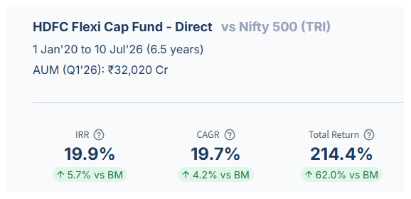
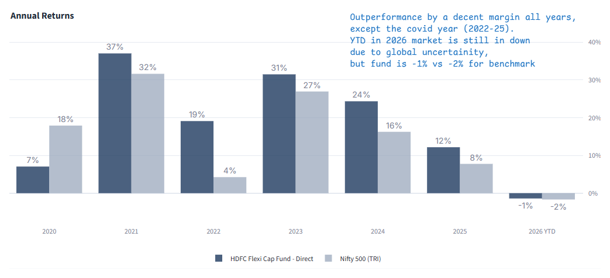
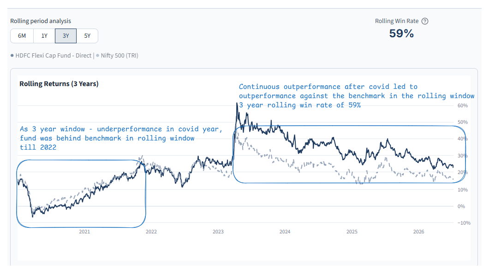
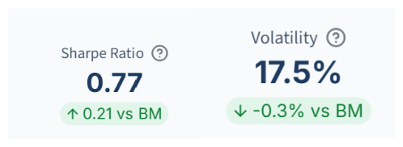
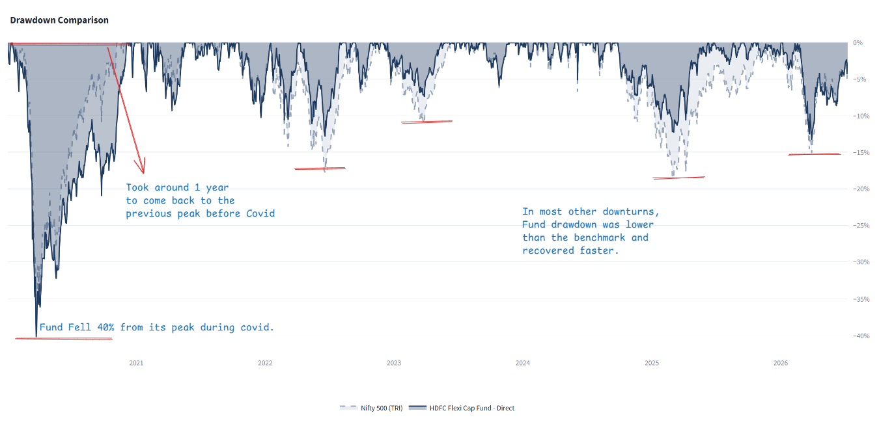

Avoiding bad investments is as important as, if not more important than, choosing a promising one. There are thousands of mutual funds in the Indian market. When someone pitches you a fund, it can become overwhelming to decide. While trying to pick the "best" fund is often futile, with a bit of investigative skill, you can assess whether a fund is suitable for you. This article demonstrates how five checks can reveal important aspects of a fund's performance and risk profile.

## The five checks

1. Did the Fund beat a fair benchmark?
2. Was the Fund's performance consistent, or just a lucky year?
3. Did the Fund's return justify the Fund's risk?
4. How far did the Fund fall when the market turned?
5. How long did the Fund take to recover from drawdown?

The first two questions provide insights on a fund's returns and performance consistency. The third one highlights the fund's risk profile to achieve those returns. The fourth and fifth questions reveal the downside scenarios. The combined picture will help you or your advisor assess the fund's performance profile and assess its suitability in your portfolio.

Let's run these checks on a well-known flexi-cap fund using our [Deepdive](https://deepdive.fundinvestigator.com/) app and see what insights we can gather. The objective is not to declare the fund "good" or "bad." It is to show what each check reveals and what you can take away from it to evaluate any fund's suitability for your circumstances.

## Investigation Settings

- Mutual Fund: HDFC Flexi Cap Fund – Direct[^hdfc-fund]
- Data Period: 1 Jan 2020 to 10 July 2026[^hdfc-data]
- Benchmark: Nifty 500 TRI[^hdfc-benchmark]

## Key takeaways

| Check | HDFC Flexi Cap vs Nifty 500 TRI (benchmark) | What does it mean? |
|---|---|---|
| **Returns vs. Benchmark** | CAGR: 19.7% vs 15.5% IRR[^hdfc-sip]: 19.9% vs 14.2% | Both the lump-sum investment and the SIP would have outperformed the benchmark |
| **Consistency** | Ahead in 5 of 6 years · 59% rolling win rate[^hdfc-rolling] | Did better than the benchmark in most periods and also on rolling basis |
| **Return vs. Risk** | Sharpe[^hdfc-sharpe]: 0.77 vs 0.56 Volatility: ~17% — similar to benchmark | Volatility was similar to the benchmark, while the higher Sharpe ratio indicates better risk-adjusted returns during the period |
| **Market Drawdown** | Max drawdown (in 6.5 years): -40% vs -38% | Fund fell more than benchmark in COVID, but shows the risk profile of equity flexi cap funds |
| **Recovery Time** | Days to recovery from max drawdown: 256 days vs 228 days | ~1 year in this instance; however, be aware that the market recovered rapidly after the COVID downturn due to economic policies. |

Let's look at these checks in detail. We used the Deepdive app for this analysis.

## Check 1: Did the fund beat a fair benchmark?

A flexi cap manager invests across large, mid, and small-cap companies. Under [SEBI's](https://www.sebi.gov.in/) scheme categorisation rules, the benchmark for this category is the Nifty 500 TRI, which covers the same broad opportunity set.

We use two primary metrics:

- CAGR: Measures the growth of money invested once at the start (lumpsum)
- IRR: Measures the growth of money entered monthly at different prices (fixed amount SIP at month start)

Both metrics can be read straight off the Fund Deepdive's KPI row.

*Figure 1: Comparison of the HDFC Flexi Cap Fund's IRR, CAGR, and total returns against the benchmark.*

### Assessment: the fund beat the benchmark on both lumpsum and SIP returns

Between 1 Jan 2020 and 10 July 2026, the HDFC Flexi Cap Fund – Direct outperformed the Nifty 500 TRI on every return measure: 19.7% CAGR against the benchmark's 15.5%, and 19.9% IRR against 14.2%. Total return over the period was 214.4%, against 152.4% for the benchmark.

## Check 2: Was the fund consistent, or did one lucky year drive the performance?

After comparing returns, the next step is consistency. Was the outperformance driven by a single successful year, or did it persist across multiple periods. We examine the annual calendar year returns and the rolling 3-year returns of both the HDFC Flexi Cap and the Nifty 500.

*Figure 2: Annual calendar year returns comparison between the HDFC Flexi Cap Fund and the Nifty 500 TRI benchmark.*

*Figure 3: Rolling 3-year returns comparison for the HDFC Flexi Cap Fund versus the Nifty 500 TRI benchmark.*

### Assessment: one weak year, then five ahead of the benchmark

HDFC Flexi Cap – Direct trailed the Nifty 500 TRI in 2020, the COVID-19 year (7% vs. 18%), but outperformed it in every subsequent year through to 2026 year to date. For the 3-year rolling returns, the fund's line trailed the benchmark initially because of that weak 2020 start. As 2020 rolled out of the 3-year calculation, the gap widened in the fund's favour. Deepdive's "Rolling Win Rate" of 59% summarises this: the fund beat its benchmark in 59% of all rolling 3-year periods in the window.

## Check 3: Did the extra return justify the extra risk?

Beating an index is less informative if the fund assumes significantly higher risk to do so. We evaluate two factors:

- **Volatility:** Measures how widely returns fluctuate. Lower volatility indicates a more stable return range.
- **Sharpe Ratio:** Compares the return above a risk-free rate to the volatility incurred to earn it. A higher number indicates superior risk-adjusted returns.

Both metrics can be read straight off the Fund Deepdive's KPI row.

*Figure 4: Risk analysis showing the volatility and Sharpe ratio for the HDFC Flexi Cap Fund and the benchmark.*

### Assessment: more return for the same risk

HDFC Flexi Cap – Direct carried volatility of 17.5%, close to the Nifty 500 TRI's 17.8%, but its Sharpe ratio was 0.77 against the benchmark's 0.56. For a similar level of risk over 1 Jan 2020 to 10 July 2026, the fund generated more return than the benchmark.

## Check 4 & 5: How much did the fund fall when the market turned? How long did it take to recover?

Finally, we examine the worst drawdown during the period and the time taken to recover. Deepdive's drawdown chart, maximum-drawdown figures, and recovery times provide evidence for both checks.

- **Maximum Drawdown:** Describes the deepest peak-to-trough decline in the period—the worst loss an investor would have experienced if they entered at the high and sold at the low. (For example, if an investment rises from ₹100 to ₹120 and then falls to ₹96, the drawdown is 20%)
- **Recovery Time:** The time required to return to the previous peak from the drawdown point. This is a critical indicator of your personal risk tolerance.

*Figure 5: Drawdown and recovery analysis illustrating the performance drop and time to recover for the HDFC Flexi Cap Fund versus the Nifty 500 TRI.*

### Assessment: a 40% fall in COVID, recovered in about a year

HDFC Flexi Cap – Direct fell further than the Nifty 500 TRI at the worst point of the period, -40.2% against -38.1%, both hitting their lows on 23 March 2020. Recovery to the previous peak took 256 days for the fund and 228 days for the benchmark — roughly a year in both cases. That speed owed much to how quickly markets rebounded after the COVID crash, so it should not be read as a reliable estimate of recovery time in a future downturn.

In the period's other drawdowns worse than 10%, the fund fell less than the benchmark and recovered slightly faster. Taken together, the fund's risk profile is broadly aligned with the benchmark's.

## What these five checks do and do not tell you

These five checks are a starting point for building a performance and risk profile. From them, you can assess a fund's suitability relative to your own risk appetite and portfolio.

They do not, on their own, explain which holdings produced the result, whether the same manager and process remain in place, or how the fund's costs compare with its peers. Those are separate investigations.

Ultimately, past performance is evidence, not a forecast. The goal of these checks is to move beyond the headline return used in the sales pitch, and to work out which areas deserve a closer look.

Apply the same framework to our [Parag Parikh Flexi Cap](/reports/ppfas-flexicap-five-checks/) and [ICICI Prudential Large Cap](/reports/icici-largecap-five-checks/) investigations.

## Notes and sources

[^hdfc-fund]: This worked example uses the Direct plan. AUM is not shown because it changes over time and is not an input to the return or risk calculations.
[^hdfc-data]: Fund NAV data is from [AMFI](https://www.amfiindia.com/); Nifty 500 TRI data is from [NSE Indices](https://www.niftyindices.com/indices/equity/broad-based-indices/nifty-500). Calculations are produced in [Fund Investigator Deepdive](https://deepdive.fundinvestigator.com/). The end date is the latest common observation available for the fund and benchmark.
[^hdfc-benchmark]: Nifty 500 TRI is the broad-market reference used for this flexi-cap example. The category rationale is discussed in Check 1.
[^hdfc-sip]: SIP IRR assumes an equal amount invested at the beginning of each month.
[^hdfc-rolling]: The rolling win rate is the share of overlapping three-year observations in which the fund's annualised return exceeded the benchmark's.
[^hdfc-sharpe]: Sharpe ratios use a 6.0% annual risk-free rate, applied consistently to the fund and benchmark.
