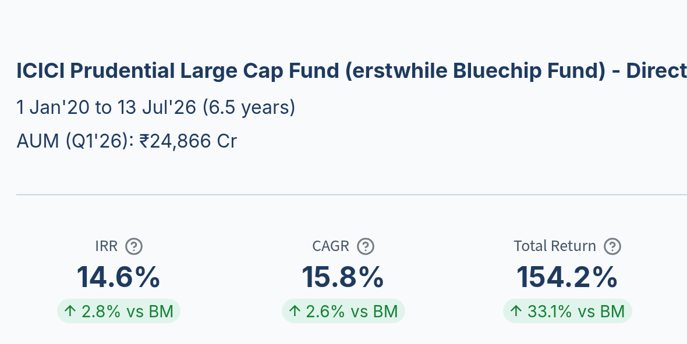
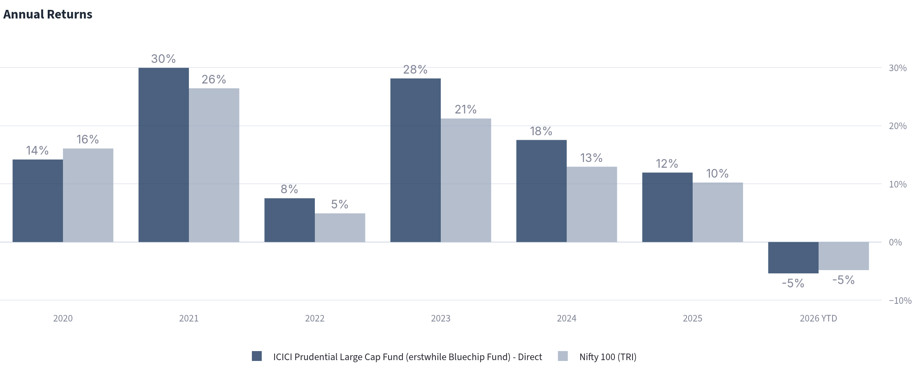
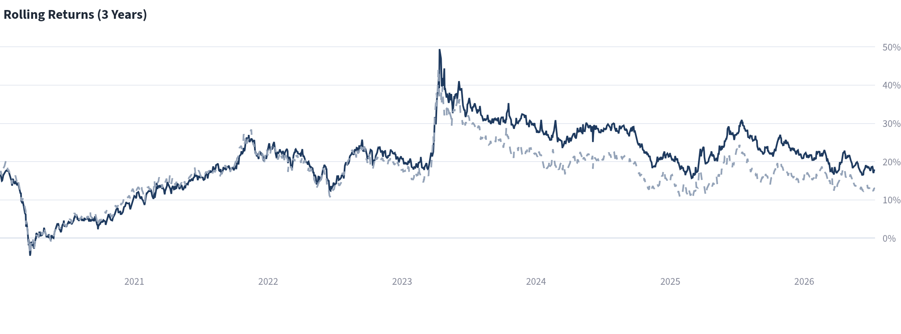
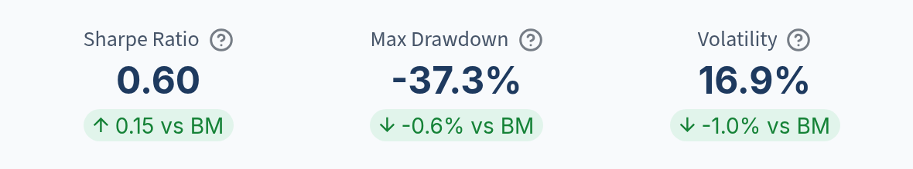
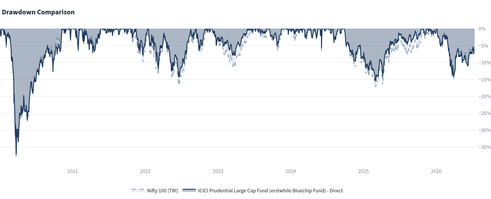

From 1 January 2020 to 13 July 2026, ICICI Prudential Large Cap Fund – Direct delivered a 15.8% CAGR against 13.1% for the Nifty 100 TRI. It finished ahead of the benchmark in five of the six completed calendar years. Its worst drawdown and recovery time, however, were almost the same as the index's.

That combination is more informative than the headline return alone. We use our [five-check framework](/reports/five-checks-mutual-fund/) to examine where the fund's historical advantage came from and where its experience remained close to the benchmark.

## The five checks

1. Did the fund beat a fair benchmark?
2. Was the fund's performance consistent, or did one year drive the result?
3. Did the fund deliver better risk-adjusted returns?
4. How far did the fund fall when the market turned?
5. How long did the fund take to recover?

Together, these checks separate the size of the return from its repeatability, the volatility incurred to earn it, and the investor's experience during a decline.

## Investigation settings

- Mutual Fund: ICICI Prudential Large Cap Fund – Direct Plan Growth[^icici-fund]
- Data Period: 1 January 2020 to 13 July 2026[^icici-data]
- Benchmark: Nifty 100 TRI[^icici-benchmark]

## Key takeaways

| Check | ICICI Prudential Large Cap vs Nifty 100 TRI | What the evidence shows |
|---|---|---|
| **Returns vs benchmark** | CAGR: 15.8% vs 13.1% SIP IRR[^icici-sip]: 14.6% vs 11.8% | Both a lump-sum investment and a fixed monthly SIP finished ahead of the benchmark over this period |
| **Consistency** | Ahead in 5 of 6 completed years 66% rolling win rate[^icici-rolling] | Outperformance appeared across calendar years and a majority of rolling 3-year observations, rather than coming from one isolated year |
| **Risk-adjusted return** | Sharpe[^icici-sharpe]: 0.60 vs 0.45 Volatility: 16.9% vs 17.8% | The fund produced the higher return with 0.9 percentage points less annualised volatility |
| **Maximum drawdown** | -37.3% vs -37.9% | The fund's worst fall was only 0.6 percentage points shallower than the benchmark's |
| **Recovery time** | 232 days vs 228 days | Recovery from the 2020 trough took four days longer for the fund—effectively the same experience in this episode |

## Check 1: Did ICICI Prudential Large Cap beat a fair benchmark?

[SEBI's scheme categorisation rules](https://www.sebi.gov.in/legal/circulars/feb-2026/categorization-and-rationalization-of-mutual-fund-schemes_99983.html) require a large-cap fund to invest at least 80% of its assets in large-cap companies. The [Nifty 100](https://www.niftyindices.com/indices/equity/broad-based-indices/nifty-100) represents the 100 largest companies by full market capitalisation from the Nifty 500, and ICICI Prudential identifies the Nifty 100 TRI as the scheme's benchmark in its [June 2026 factsheet](https://www.icicipruamc.com/blob/knowledgecentre/factsheet-schemes/Schemes/1.%20Equity%20Schemes/ICICI%20Prudential%20Large%20Cap%20Fund.pdf).

We examine three return measures:

- **CAGR:** The annualised growth of a lump-sum investment made at the start of the period
- **SIP IRR:** The annualised return on equal monthly investments, accounting for the timing of each cash flow
- **Total return:** The cumulative change from the beginning to the end of the period

*Figure 1: ICICI Prudential Large Cap Fund's SIP IRR, CAGR and total return, with the margin over the Nifty 100 TRI shown beneath each measure.*

### Assessment: the fund finished ahead on both lump-sum and SIP returns

Between 1 January 2020 and 13 July 2026, ICICI Prudential Large Cap Fund – Direct delivered a 15.8% CAGR against 13.1% for the Nifty 100 TRI, a difference of 2.7 percentage points a year. Its SIP IRR was 14.6% against 11.8%. Total return over the full period was 154.2%, compared with 121.1% for the benchmark.

These are historical results for this particular start and end date. The next check asks whether the advantage appeared repeatedly within the period.

## Check 2: Was the outperformance consistent, or did one year drive it?

Calendar-year returns show whether the result was spread across different market conditions. Rolling 3-year returns test the same question without relying on a single starting date.

*Figure 2: Calendar-year returns for ICICI Prudential Large Cap Fund and the Nifty 100 TRI.*

*Figure 3: Rolling 3-year returns. The solid dark line is the fund; the dashed light line is the Nifty 100 TRI.*

### Assessment: five completed years ahead, with a 66% rolling win rate

ICICI Prudential Large Cap – Direct trailed the Nifty 100 TRI in 2020, returning 14% against 16%. It then finished ahead in every completed calendar year from 2021 through 2025. In 2026 year to date, both returns round to -5% in the chart.

The fund also beat the benchmark in 66% of the 3-year rolling observations shown by Deepdive. The annual and rolling views therefore point in the same direction: the result was not carried by one isolated year, although the fund did not lead throughout the full window.

## Check 3: Did the fund deliver better risk-adjusted returns?

A return comparison is incomplete without examining the volatility incurred to produce it. We use two measures calculated over the same analysis period:

- **Volatility:** The annualised dispersion of returns. A lower figure means returns fluctuated within a narrower range.
- **Sharpe ratio:** The return above the risk-free rate divided by volatility. When calculated using the same period and assumptions, a higher figure indicates more return per unit of measured volatility.

*Figure 4: ICICI Prudential Large Cap Fund's risk metrics and their differences from the Nifty 100 TRI.*

### Assessment: higher return with slightly lower volatility

ICICI Prudential Large Cap – Direct recorded annualised volatility of 16.9%, compared with 17.8% for the Nifty 100 TRI. Its Sharpe ratio was 0.60 against the benchmark's 0.45.

Over 1 January 2020 to 13 July 2026, the fund therefore delivered the higher return with 0.9 percentage points less volatility. That describes one dimension of risk; maximum drawdown provides a separate view of the loss experienced during market stress.

## Check 4: How far did the fund fall when the market turned?

Maximum drawdown is the deepest peak-to-trough decline in the analysis period. It describes the largest fall from a previous high, whether or not an investor sold at the low.

*Figure 5: Drawdowns for ICICI Prudential Large Cap Fund and the Nifty 100 TRI from January 2020 to July 2026.*

### Assessment: the worst fall was almost the same as the benchmark's

ICICI Prudential Large Cap – Direct reached a maximum drawdown of -37.3%, while the Nifty 100 TRI fell -37.9%. Both reached their trough on 23 March 2020.

The fund's worst decline was therefore 0.6 percentage points shallower. That is a measurable difference, but not evidence of materially different downside exposure during this episode: both lost approximately 37% from peak to trough.

## Check 5: How long did recovery take?

For this analysis, recovery time is measured from the drawdown trough until the investment returned to its previous peak. It shows how long capital remained below that earlier high after the lowest point.

### Assessment: recovery took 232 days, four days longer than the benchmark

ICICI Prudential Large Cap – Direct recovered its pre-decline peak 232 days after the 23 March 2020 trough. The Nifty 100 TRI took 228 days. In this drawdown, the fund and benchmark therefore had effectively the same recovery experience.

The 2020 rebound was unusually rapid. These recovery times describe that episode and should not be treated as an estimate of how quickly either investment would recover from a future decline.

## Evidence summary: return advantage, benchmark-like downside

Across 1 January 2020 to 13 July 2026, the strongest evidence for ICICI Prudential Large Cap – Direct is in returns and repeatability. The fund beat the Nifty 100 TRI by 2.7 percentage points in CAGR, led in five of six completed calendar years, won 66% of the rolling 3-year observations, and recorded a higher Sharpe ratio with slightly lower volatility.

The downside evidence is less differentiated. Its maximum drawdown was only 0.6 percentage points shallower, and recovery took four days longer. Over this window, the fund's advantage came from return and consistency rather than materially better protection during the worst decline.

## What these five checks do not explain

These checks describe historical performance; they do not identify which holdings produced it, whether the investment process has changed, or how costs compare with peers.

Manager continuity also requires separate examination. The scheme's June 2026 factsheet records Vaibhav Dusad as a manager since January 2021, Sankaran Naren since February 2026, and Sharmila D'Silva since March 2026. Most of the performance window therefore predates the current management team as a whole.

Past performance is evidence, not a forecast. These five checks establish what happened over the selected period and identify the next questions; they do not determine whether the fund is suitable for a particular portfolio.

Read [The Five Checks to Investigate a Mutual Fund](/reports/five-checks-mutual-fund/) for the full method and its limitations.

## Notes and sources

[^icici-fund]: The scheme was formerly named ICICI Prudential Bluechip Fund. Its [AMFI scheme code is 120586](https://portal.amfiindia.com/spages/SSD_3445.pdf).
[^icici-data]: Fund NAV data is from [AMFI NAV history](https://www.amfiindia.com/net-asset-value/nav-history); benchmark data is from [NSE Indices — Nifty 100](https://www.niftyindices.com/indices/equity/broad-based-indices/nifty-100). Calculations are produced in [Fund Investigator Deepdive](https://deepdive.fundinvestigator.com/).
[^icici-benchmark]: ICICI Prudential identifies Nifty 100 TRI as the scheme benchmark in its [June 2026 factsheet](https://www.icicipruamc.com/blob/knowledgecentre/factsheet-schemes/Schemes/1.%20Equity%20Schemes/ICICI%20Prudential%20Large%20Cap%20Fund.pdf). The category rationale is discussed in Check 1.
[^icici-sip]: SIP IRR assumes an equal amount invested at the beginning of each month.
[^icici-rolling]: The rolling win rate is the share of overlapping three-year observations in which the fund's annualised return exceeded the benchmark's.
[^icici-sharpe]: Sharpe ratios use a 6.0% annual risk-free rate, applied consistently to the fund and benchmark.
