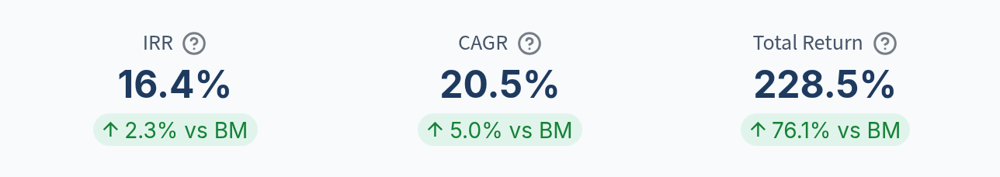
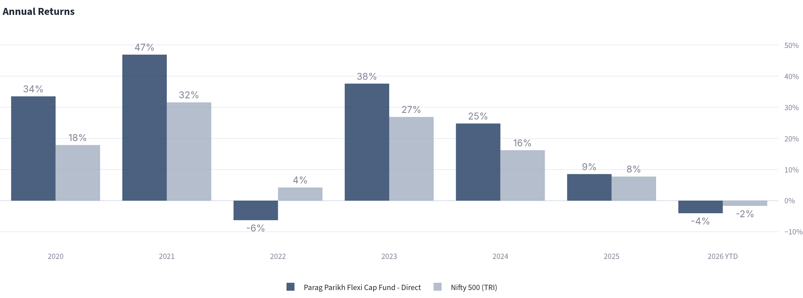
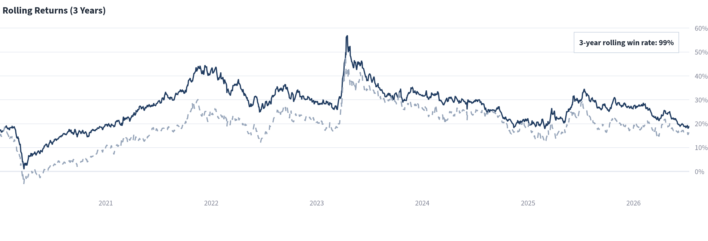
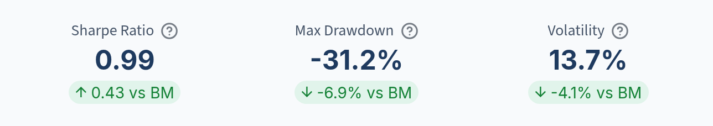
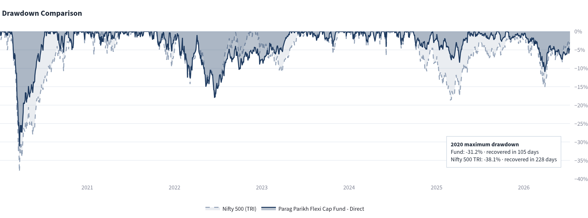

From 1 January 2020 to 13 July 2026, Parag Parikh Flexi Cap Fund – Direct delivered a 20.5% CAGR against 15.5% for the Nifty 500 TRI. It beat the benchmark in 99% of the rolling 3-year observations and did so with lower volatility. During the period's worst decline, the fund fell 31.2% and recovered from its trough in 105 days; the index fell 38.1% and took 228 days to recover.

The lead was broad, but not uninterrupted. The fund finished ahead in five of the six completed calendar years, trailed the index by 10 percentage points in 2022, and remained behind in 2026 year to date. We use our [five-check framework](/reports/five-checks-mutual-fund/) to examine both sides of that record.

## The five checks

1. Did the fund beat a fair benchmark?
2. Was the fund's performance consistent, or did one year drive the result?
3. Did the fund deliver better risk-adjusted returns?
4. How far did the fund fall when the market turned?
5. How long did the fund take to recover?

Together, these checks separate the size of the return from its repeatability, the volatility incurred to earn it, and the investor's experience during a decline.

## Investigation settings

- Fund: Parag Parikh Flexi Cap Fund – Direct Plan – Growth (AMFI code 122639)
- Analysis period: 1 January 2020 to 13 July 2026, the latest common date available for the fund and benchmark in Deepdive
- Benchmark: Nifty 500 TRI, the scheme's AMFI Tier I benchmark
- SIP assumption: A fixed amount invested at the beginning of each month
- Rolling-return period: Three years; each plotted date measures the preceding three years, so the earliest observations use history before January 2020
- Rolling win rate: The share of rolling 3-year observations in which the fund's annualised return exceeded the benchmark's
- Sharpe-ratio assumption: 6.0% risk-free rate, applied consistently to the fund and benchmark
- Fund NAV source: [AMFI NAV history](https://www.amfiindia.com/net-asset-value/nav-history)
- Benchmark source: [NSE Indices — Nifty 500](https://www.niftyindices.com/indices/equity/broad-based-indices/nifty-500)
- Scheme facts: [PPFAS Mutual Fund — June 2026 factsheet](https://amc.ppfas.com/downloads/factsheet/2026/ppfas-mf-factsheet-for-June-2026.pdf?08072026=)
- Analysis: [FundInvestigator Deepdive](https://deepdive.fundinvestigator.com/)

## Key takeaways

| Check | Parag Parikh Flexi Cap vs Nifty 500 TRI | What the evidence shows |
|---|---|---|
| **Returns vs benchmark** | CAGR: 20.5% vs 15.5% SIP IRR: 16.4% vs 14.1% | Both a lump-sum investment and a fixed monthly SIP finished ahead of the benchmark over this period |
| **Consistency** | Ahead in 5 of 6 completed years 99% rolling win rate | The fund's lead appeared across most calendar years and almost every rolling 3-year observation, despite a clear setback in 2022 |
| **Risk-adjusted return** | Sharpe: 0.99 vs 0.56 Volatility: 13.7% vs 17.8% | The fund produced the higher return with 4.1 percentage points less annualised volatility |
| **Maximum drawdown** | -31.2% vs -38.1% | The fund's worst fall was 6.9 percentage points shallower than the benchmark's |
| **Recovery time** | 105 days vs 228 days | The fund regained its previous peak 123 days sooner after the 2020 trough |

## Check 1: Did Parag Parikh Flexi Cap beat a fair benchmark?

[SEBI's scheme categorisation rules](https://www.sebi.gov.in/legal/circulars/feb-2026/categorization-and-rationalization-of-mutual-fund-schemes_99983.html) require a flexi-cap fund to invest at least 65% of its assets in equity and equity-related instruments, with the mandate spanning large-, mid- and small-cap stocks. The [Nifty 500](https://www.niftyindices.com/indices/equity/broad-based-indices/nifty-500) represents 500 companies selected from the eligible NSE universe, and PPFAS identifies the Nifty 500 TRI as the scheme's AMFI Tier I benchmark in its [June 2026 factsheet](https://amc.ppfas.com/downloads/factsheet/2026/ppfas-mf-factsheet-for-June-2026.pdf?08072026=).

The benchmark is fair for testing the fund against its declared broad-market reference, but it is not a mirror of the portfolio. The scheme's stated objective permits Indian equities, foreign equities and debt securities, while the Nifty 500 TRI represents Indian equities. The comparison therefore measures the outcome of the active strategy against its official benchmark; it does not assume identical exposures.

We examine three return measures:

- **CAGR:** The annualised growth of a lump-sum investment made at the start of the period
- **SIP IRR:** The annualised return on equal monthly investments, accounting for the timing of each cash flow
- **Total return:** The cumulative change from the beginning to the end of the period

*Figure 1: Parag Parikh Flexi Cap Fund's SIP IRR, CAGR and total return, with the margin over the Nifty 500 TRI shown beneath each measure.*

### Assessment: the fund finished ahead on both lump-sum and SIP returns

Between 1 January 2020 and 13 July 2026, Parag Parikh Flexi Cap Fund – Direct delivered a 20.5% CAGR against 15.5% for the Nifty 500 TRI, a difference of 5.0 percentage points a year. Its SIP IRR was 16.4% against 14.1%. Total return over the full period was 228.5%, compared with 152.4% for the benchmark.

These are point-to-point results for one start and end date. The next check tests whether that advantage appeared repeatedly within the period.

## Check 2: Was the outperformance consistent, or did one year drive it?

Calendar-year returns show whether the result was spread across different market conditions. Rolling 3-year returns test the same question across many overlapping periods rather than relying on one starting date.

*Figure 2: Calendar-year returns for Parag Parikh Flexi Cap Fund and the Nifty 500 TRI.*

*Figure 3: Rolling 3-year returns. The solid dark line is the fund; the dashed light line is the Nifty 500 TRI.*

### Assessment: broad historical consistency, with a distinct 2022 setback

Parag Parikh Flexi Cap – Direct finished ahead of the Nifty 500 TRI in 2020, 2021 and every completed year from 2023 through 2025. The exception was 2022: the fund returned -6% while the index gained 4%. In 2026 year to date, the fund was down 4% against a 2% decline for the benchmark, at the chart's rounded precision.

Deepdive's rolling test is stronger than the calendar count. The fund beat the benchmark in 99% of the 3-year observations ending within the selected analysis window. That figure does not mean the fund won in 99% of days or calendar years. It means the fund's annualised return was higher across almost every overlapping 3-year period measured here.

## Check 3: Did the fund deliver better risk-adjusted returns?

A return comparison is incomplete without examining the volatility incurred to produce it. We use two measures calculated over the same analysis period and with the same 6.0% risk-free-rate assumption:

- **Volatility:** The annualised dispersion of returns. A lower figure means returns fluctuated within a narrower range.
- **Sharpe ratio:** The return above the risk-free rate divided by volatility. When calculated using the same period and assumptions, a higher figure indicates more return per unit of measured volatility.

*Figure 4: Parag Parikh Flexi Cap Fund's risk metrics and their differences from the Nifty 500 TRI.*

### Assessment: higher return with lower volatility

Parag Parikh Flexi Cap – Direct recorded annualised volatility of 13.7%, compared with 17.8% for the Nifty 500 TRI. Its Sharpe ratio was 0.99 against the benchmark's 0.56.

Over 1 January 2020 to 13 July 2026, the fund therefore delivered the higher return with 4.1 percentage points less volatility. Volatility describes the spread of returns; maximum drawdown separately measures the depth of the loss from a previous peak.

## Check 4: How far did the fund fall when the market turned?

Maximum drawdown is the deepest peak-to-trough decline in the analysis period. It describes the largest fall from a previous high, whether or not an investor sold at the low.

*Figure 5: Drawdowns for Parag Parikh Flexi Cap Fund and the Nifty 500 TRI. The annotation summarises the depth and recovery of the maximum drawdown.*

### Assessment: the fund's worst fall was 6.9 percentage points shallower

Parag Parikh Flexi Cap – Direct reached a maximum drawdown of -31.2% on 24 March 2020. The Nifty 500 TRI fell -38.1%, reaching its trough one day earlier.

The fund's worst decline was therefore 6.9 percentage points shallower. This is evidence of a different downside experience in the period's most severe fall, but it does not establish how the fund would behave in a future drawdown with different causes or market leadership.

## Check 5: How long did recovery take?

For this analysis, recovery time is measured from the drawdown trough until the investment returned to its previous peak. It shows how long capital remained below that earlier high after the lowest point.

### Assessment: the fund recovered 123 days sooner

Parag Parikh Flexi Cap – Direct recovered its pre-decline peak on 7 July 2020, 105 days after its 24 March trough. The Nifty 500 TRI recovered on 6 November 2020, 228 days after its trough. The fund therefore completed the recovery 123 days sooner by this measure.

The 2020 rebound was unusually rapid. These recovery times describe that episode and should not be treated as an estimate of how quickly either investment would recover from a future decline.

## Evidence summary: the advantage appeared in return, consistency and downside

Across 1 January 2020 to 13 July 2026, Parag Parikh Flexi Cap – Direct beat the Nifty 500 TRI by 5.0 percentage points in CAGR, led in five of six completed calendar years, and won 99% of the rolling 3-year observations. Its Sharpe ratio was higher, volatility was 4.1 percentage points lower, and its maximum drawdown was 6.9 percentage points shallower with a recovery 123 days faster.

The exceptions matter. The fund trailed by 10 percentage points in 2022 and remained behind in 2026 year to date. The historical evidence is broad across this window, but it is not a record of uninterrupted outperformance.

## What these five checks do not explain

These checks describe outcomes; they do not identify which holdings, geographies or asset-allocation choices produced them. That distinction matters here because the scheme can hold foreign equities and debt securities alongside Indian equities. Its June 2026 factsheet also notes that fresh investment in foreign securities was temporarily suspended from 2 February 2022 and later permitted only within the available overseas-investment headroom. This analysis does not isolate the effect of that constraint.

Manager continuity requires separate examination too. The June 2026 factsheet records Rajeev Thakkar and Raunak Onkar in their respective equity and overseas roles since inception, Rukun Tarachandani since May 2022, and Raj Mehta since September 2025. The five checks cannot attribute the historical result to any one manager or determine whether the process will produce the same outcome again.

Past performance is evidence, not a forecast. These checks establish what happened over the selected period; they do not determine whether the fund is suitable for a particular portfolio.

Read [The Five Checks to Investigate a Mutual Fund](/reports/five-checks-mutual-fund/) for the full method and its limitations.
