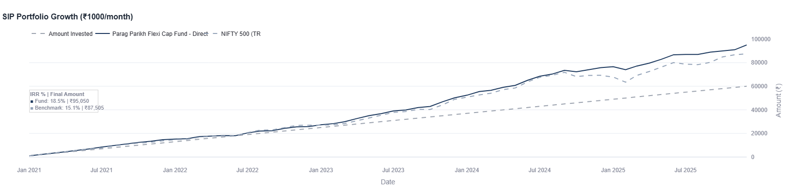
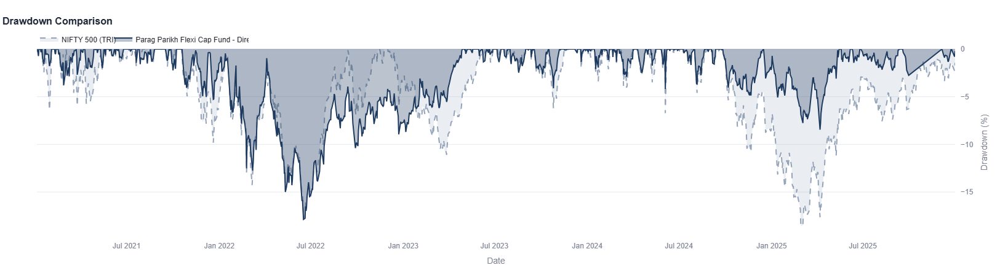
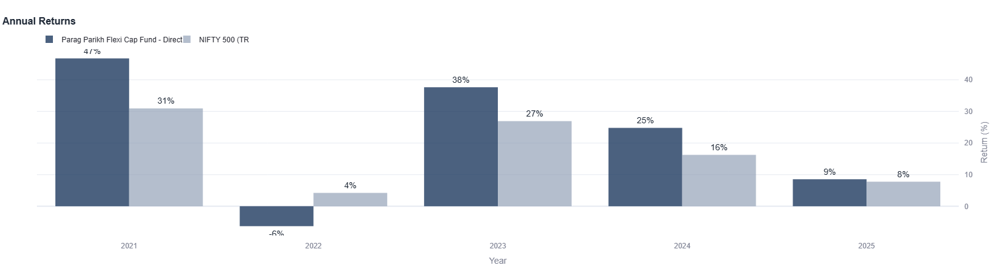
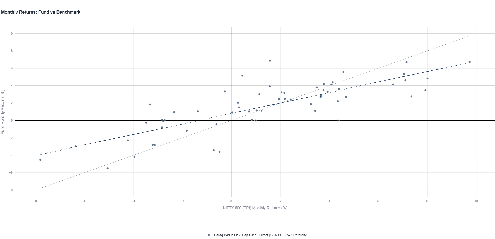

# Parag Parikh Flexicap - Direct: 5 Years of Data Analysis

When evaluating mutual funds, numbers tell a story. Here's what 5 years of data reveals about Parag Parikh Flexicap - Direct, analyzing risk and SIP returns versus the NIFTY 500 TRI benchmark.

## The Numbers That Matter

Over the five-year period from January 2021 to December 2025, Parag Parikh Flexicap - Direct delivered a 22.1% CAGR compared to its NIFTY 500 (TRI) benchmark's 17.1%. In real terms, that's a 156.5% cumulative return versus the benchmark's 117.0%—a 39.5-point difference.

For someone investing ₹1,000 monthly through a SIP, the fund would have grown to ₹95,050 (with 18.5% IRR) versus ₹87,505 in the benchmark. That's approximately ₹7,500 more from the same disciplined investment approach.

But here's where it gets interesting: The fund achieved these higher returns while taking noticeably less risk. With volatility of 12.0% versus the benchmark's 14.33%, the fund delivered superior returns with lower volatility.

## Risk Management: The Overlooked Story

The maximum drawdown tells you about worst-case scenarios. When markets corrected, Parag Parikh Flexicap bottomed at -17.9%, while the benchmark dropped to -18.59%. More importantly, the fund recovered in just 1.25 years, demonstrating relatively swift recovery from market stress.

The Sharpe Ratio of 1.52 (versus 1.00) shows the fund generated 1.52 units of return for every unit of risk—outpacing the benchmark on an efficiency basis.

| Metric | Fund | Benchmark |
|--------|------|-----------|
| Volatility | 12.0% | 14.33% |
| Max Drawdown | -17.9% | -18.59% |
| Sharpe Ratio | 1.52 | 1.00 |
| Annual Consistency | 80% | — |

## How Consistent Was the Performance?

Consistency reveals whether outperformance is skill or luck.

The fund delivered positive returns in 4 out of 5 calendar years. Annually, performance varied: 2021 (+34%), 2022 (-5%), 2023 (+38%), 2024 (+25%), and 2025 (+9%). The notable dip in 2022 was shared across equity markets, but the fund recovered strongly in subsequent years with notable outperformance in 2023 and 2024.

On a monthly basis, the fund generated positive returns 58.3% of the time. This isn't about beating the benchmark every month—it's about maintaining a consistent approach while allowing normal volatility.

## Understanding the Fund-Benchmark Relationship

With a correlation of 0.8118 and beta of 0.67, the fund tracks the benchmark direction but moves about 33% less. The R² of 0.6590 means the benchmark explains roughly two-thirds of the fund's movements—there's genuine active management happening underneath.

This matters because it shows the fund isn't simply trying to replicate the benchmark. The active risk of 8.51% represents deliberate portfolio choices—stocks selected and sectors weighted differently—that have translated into measurable outperformance despite lower overall volatility.

## What This Actually Means

Higher returns, lower volatility, strong recovery from drawdowns, and consistent annual performance. These aren't theoretical advantages—they compound into real wealth differences over time.

A ₹10 lakh investment at the start of 2021 would have become approximately ₹25.65 lakh in the fund versus ₹21.7 lakh in the benchmark. That's approximately ₹3.95 lakh in additional wealth from the same initial capital.

But data is just one part of the story. Your investment goals, time horizon, risk tolerance, and life circumstances matter just as much. A fund that outperformed over these five years doesn't guarantee future results. Markets evolve, management can change, economic conditions shift.

## The Complete Picture

Want to dig deeper? The Fund Investigator - Mutual Fund Deepdive platform lets you:

- Adjust time periods to see performance across different market cycles
- Compare this fund against other options in the category
- Analyze rolling returns to understand consistency
- Download detailed charts and metrics
- Examine monthly breakdowns and risk patterns